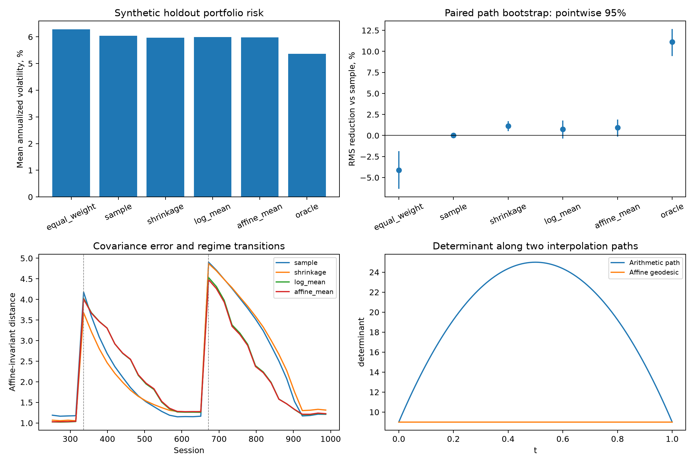
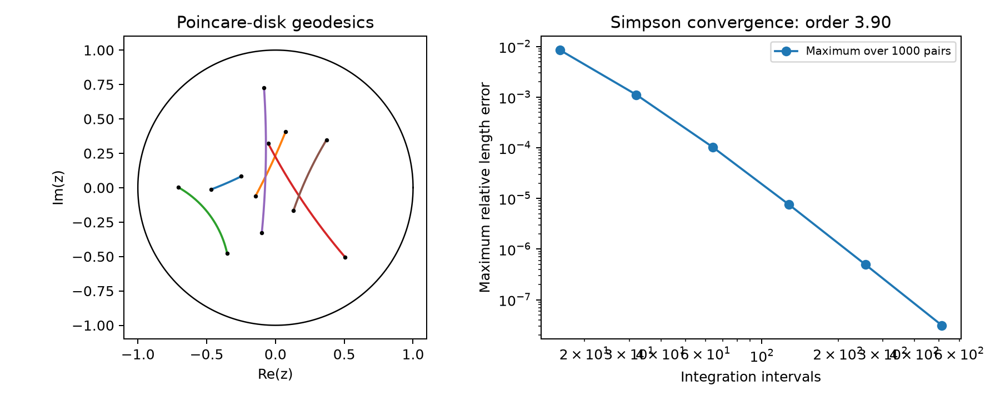

# Non-Euclidean geometry: covariance manifolds and portfolio risk

A numerical study of affine-invariant statistics on positive definite covariance matrices, with a synthetic portfolio-risk experiment. The original hyperbolic, Möbius and Lorentz benchmarks remain available as a separate study originating from a 2025 TIPE.



## Covariance geometry for allocation

The implementation provides matrix logarithms and exponentials, affine-invariant geodesics, logarithmic and exponential maps, parallel transport, log-Euclidean means and an iterative Fréchet mean with Armijo backtracking. Tests check congruence invariance, constant-speed geodesics, determinant interpolation, transported inner products and stationarity of the mean.

The allocation experiment uses **20 independent synthetic paths**, each with **12 assets and 1,008 sessions**, three covariance regimes and variance-matched Student t innovations with five degrees of freedom. Initial chronological validation selects shrinkage separately for each estimator. Every later fit uses only the preceding 252 sessions. Portfolios rebalance every 21 sessions, with long-only weights capped at 25% at each rebalance, daily holdings drift and a 5 bp one-way proportional cost.

| Covariance estimator | Mean annualized portfolio volatility | RMS reduction vs sample | Paired path bootstrap 95% interval |
| --- | ---: | ---: | ---: |
| sample | 6.038% | baseline | baseline |
| diagonal shrinkage | 5.970% | 1.12% | [0.53%, 1.70%] |
| log-Euclidean block mean | 5.995% | 0.76% | [-0.36%, 1.77%] |
| affine-invariant block mean | 5.984% | 0.93% | [-0.13%, 1.90%] |
| known-covariance oracle | 5.371% | 11.14% | [9.43%, 12.65%] |

The geometric methods have small allocation gains in this design, with intervals spanning zero. Their portfolio variance forecasts are about 21.9% below the known conditional variance on average, versus 1.65% for validation-selected diagonal shrinkage. A geometric mean's smaller determinant does not automatically imply a better risk forecast. The oracle uses unobservable covariance states and is a diagnostic reference.

There are **720 rolling affine-mean fits**, all converging in at most **26 iterations**, with maximum whitened gradient norm **9.98e-10**. The comparison intervals use 4,000 paired resamples of complete paths, preserving dependence within each path. They are pointwise and measure Monte Carlo uncertainty under this specified synthetic model.

## Run the research study

After installing the package as shown below:

```bash
python -m geometry_lab.research
python -m unittest discover -s tests -v
python -m geometry_lab.research --quick --output /tmp/geometry-research
```

[`docs/research.md`](docs/research.md) derives the manifold operations, covariance estimators and portfolio accounting. [`results/research/`](results/research) includes every synthetic asset return, the true covariance matrices, daily portfolios, validation scores, solver diagnostics, path-level uncertainty, figures and checksums. CI runs mathematical tests and a small complete experiment.

## Original geometry benchmarks

Numerical experiments on hyperbolic geodesics, Möbius transformations and Lorentz boosts. The starting point is a 2025 TIPE on spherical geometry, the Riemann sphere and geometrical applications in physics; the computational study benchmarks lengths and invariants rather than stopping at visualization.



## Results

| Benchmark | Samples | Result |
| --- | ---: | --- |
| Poincaré-disk geodesic lengths | 1,000 point pairs | Maximum relative length error 3.132e-08 at 512 Simpson intervals |
| Quadrature convergence | 16 to 512 intervals | Empirical order 3.90, fitted over the final four grids |
| Cross-ratio invariance | 10,000 Möbius maps | Maximum normalized error 2.142e-14 |
| Minkowski-interval invariance | 10,000 Lorentz boosts | Maximum normalized error 8.993e-14 |

## Geometry

The Poincaré metric is `ds = 2 |dz| / (1 - |z|^2)`. To join points a and b, the disk automorphism `w = (z-a)/(1-conj(a)z)` sends a to the origin. The inverse image of the radial segment from 0 to w(b) gives the geodesic. Integrating its metric speed by composite Simpson quadrature is compared against the closed-form distance `2 atanh(|w(b)|)`.

This is an integration benchmark on an analytically parameterized geodesic, not a numerical shortest-path optimizer. Metric and radial distance conventions follow equations 1.16 and 1.17 of [Danny Calegari's hyperbolic geometry notes](https://math.uchicago.edu/~dannyc/books/3manifolds/3_manifolds_chapter_2.pdf), page 8.

The cross ratio of four complex points is compared before and after a fractional linear transformation. Lorentz boosts along the x axis preserve `-ct^2 + x^2 + y^2 + z^2`. Both comparisons use float64 arithmetic and synthetic samples.

## Reproduce

```bash
python -m venv .venv
# Windows: .venv\Scripts\activate
# Linux/macOS: source .venv/bin/activate
python -m pip install -e .
python -m geometry_lab.experiment
python -m unittest discover -s tests -v
```

Python 3.10 or later is required. The committed results use Python 3.12.14 and NumPy 2.5.3. The fixed seed is 20260930, with separate random streams for the three benchmarks.

## Conditioning and error conventions

Geodesic endpoints are sampled uniformly in area from a disk of radius 0.75. Errors near the boundary of the unit disk can be larger; no uniform accuracy over the entire disk is claimed.

Möbius matrices have unit Frobenius norm. Before evaluating invariance, candidates must have determinant magnitude at least 0.15 and denominator magnitudes at least 0.05 at the four input points. Rejection depends on conditioning, not the measured error. The accepted 10,000 cases use 11,732 candidate matrices.

Lorentz velocities satisfy beta in [-0.99, 0.99]. Invariant errors are normalized as `abs(after-before) / max(1, abs(before))`; they measure floating-point consistency in these sampled domains, not physical experimental uncertainty.

The tests check the known radial distance log(3), endpoints, symmetry, convergence, a fixed homography and a Lorentz boost. `results/` includes all lengths, errors, convergence measurements, figures, the protocol and CSV hashes.

Code: MIT license.
